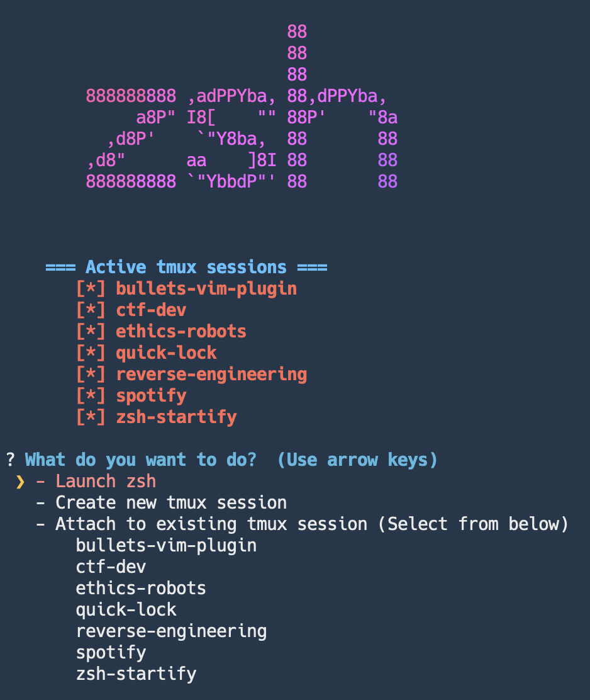
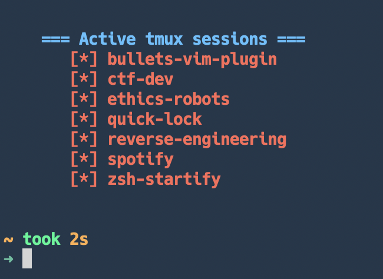

# zsh-startify

<h1 align="center">
  
  <br />
</h1>

You can also use it in a more minimal configuration, like this:

<h1 align="center">
  
  <br />
</h1>

This is a fancy start screen for `zsh`. After starting a terminal session, it will:

+ Start a `tmux` server if it's not already running
+ Allow you to easily attach to any `tmux` sessions
+ Allow you to easily create new tmux sessions
+ Allow you to quickly launch a `zsh` session, by `Ctrl-C`'ing or `Ctrl-D`'ing out of the prompt.

## Installation

The recommended installation method is through `PyPi`:

```bash
$ pip3 install zsh-startify
$ echo "zsh-startify" >> ~/.zshrc
```

But, if you'd like to install it manually:

```bash
$ git clone git@github.com:alichtman/zsh-startify.git && cd zsh-startify
$ python3 setup.py install
$ echo "zsh-startify" >> ~/.zshrc
```

Note: This tool depends on `Python 3.6+`. You can check what version you have with:

```bash
$ python3 --version
Python 3.7.4
```

## Configuration

This tool comes with sensible defaults. No configuration is necessary, however, the following settings may be changed in your `~/.zshrc` file:

- **ZSH_STARTIFY_HEADER_FONT**
	+ This is the Figlet font that the header text will be printed in.
	+ Default: `univers`. Accepts any [Figlet font](http://www.figlet.org/examples.html).
- **ZSH_STARTIFY_HEADER_TEXT**
	+ This string will be printed as the header.
	+ Default: `zsh`. Accepts any string.
- **ZSH_STARTIFY_NO_SPLASH**
	+ Set this environment variable to not print the splash screen.
	+ Default: Not set. If set to anything, the splash screen will not be printed.
- **ZSH_STARTIFY_NON_INTERACTIVE**
	+ Set this environment variable to not display the action picking menu.
	+ Default: Not set. If set to anything, the interactive menu will not be displayed.

An example of this could be:

```bash
export ZSH_STARTIFY_HEADER_TEXT="custom-header"
export ZSH_STARTIFY_HEADER_FONT="slant"
```

My configuration is:

```bash
export ZSH_STARTIFY_NO_SPLASH=true
export ZSH_STARTIFY_NON_INTERACTIVE=true
```

## `tmux`Integration

This works best when used with these two `tmux` plugins:

- [`tmux-resurrect`](https://github.com/tmux-plugins/tmux-resurrect)
- [`tmux-continuum`](https://github.com/tmux-plugins/tmux-continuum)

## Inspiration

I've used [vim-startify](https://github.com/mhinz/vim-startify) a lot. I figured it was time for `zsh` and `tmux` to have a similar tool.
